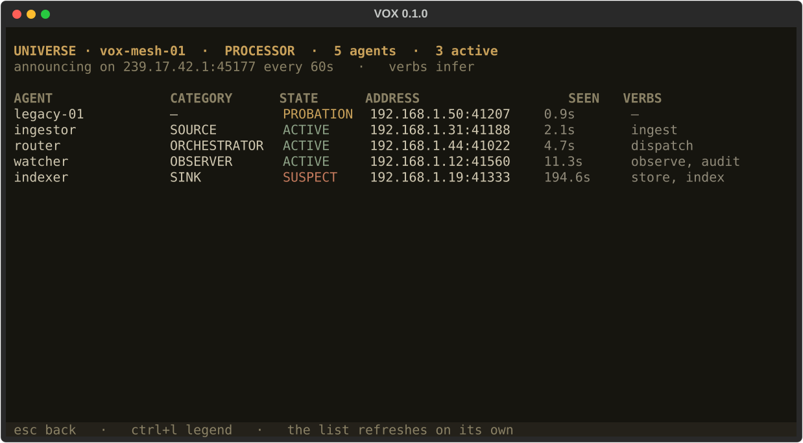

<p align="center">
  
</p>

# VOX

A terminal chat client for coding, for any OpenAI-compatible endpoint: Ollama,
llama.cpp server, vLLM, LM Studio, a remote gateway. Linux, macOS, Windows,
Termux.


## Requirements

- Python 3.11 or newer — the installer offers to fetch it if it is missing
- A running OpenAI-compatible server — for Ollama: `ollama serve`

## Quick start

**1. Install.** No administrator rights needed, safe to re-run.

```bash
git clone https://github.com/atagliente/vox && cd vox && sh install.sh
```

Windows, in PowerShell:

```bash
git clone https://github.com/atagliente/vox; cd vox; powershell -ExecutionPolicy Bypass -File .\install.ps1
```

It checks Python, installs through `pipx` (or a private virtual environment in
`~/.vox/venv`), puts a `vox` launcher on your user `PATH`, then runs the check
below.

On Linux it also offers to install what is missing — on Debian and Ubuntu that
is usually `python3-venv`, which ships separately from `python3` — showing the
exact command and asking before it runs anything with `sudo`.

**2. Check.**

```bash
vox doctor
```

```text
[ OK ] PYTHON   3.12.3
[ OK ] DEPS     openai 3.3.1 | textual 8.2.8 | rich 15.0.0
[ OK ] CONFIG   /home/you/.vox
[FAIL] LINK     cannot reach provider: http://localhost:11434/v1
```

Exit code `0` ready, `1` installed but the server is unreachable, `2` something
blocking. If `LINK` fails, fix the endpoint — see the next section.

**3. Run.**

```bash
vox
```

Type, press `Enter` to send. `/help` lists every command.

## Point it at your server

`~/.vox/config.json` is written on first run. The parts that matter:

```json
{
  "active_provider": "local-ollama",
  "active_model": "qwen2.5-coder:3b",
  "providers": {
    "local-ollama": {
      "base_url": "http://localhost:11434/v1",
      "api_key": "ollama",
      "extra_body": { "keep_alive": "30m" }
    }
  }
}
```

Edit it with `/settings` in the app, or `/config` to open it in `$EDITOR`; a
broken edit is rejected and the previous configuration kept.

For a server on another machine set `base_url` to `http://<address>:11434/v1`
and start Ollama there with `OLLAMA_HOST=0.0.0.0:11434 ollama serve`. That
server has **no authentication** — only do this on a network you trust.

## Keys

| Key | Action | Key | Action |
| --- | --- | --- | --- |
| `Enter` | send | `Ctrl+P` | prompts |
| `Alt+Enter` / `Ctrl+J` | new line | `Ctrl+R` | roles |
| `Ctrl+C` / `Ctrl+V` | copy / paste | `Ctrl+S` | settings |
| `Ctrl+Y` | copy last code block | `Ctrl+G` | stop generating |
| `↑` / `↓` | input history | `Ctrl+B` | side panel |
| `Ctrl+N` / `Ctrl+W` | new / save session | `Ctrl+T` / `Ctrl+E` | inspect / export |
| `Ctrl+Shift+O` | join / leave the mesh | `Ctrl+Shift+U` | the universe |
| | | `Ctrl+Q` | quit |

The bottom row shows this legend at all times.

## Commands

| Command | Effect |
| --- | --- |
| `/model [name]`, `/provider [name]` | switch, without restarting |
| `/role [name]`, `/prompts`, `/sessions` | pick a persona, a saved prompt, a session |
| `/session-save [name]`, `/session-load <name>` | sessions live next to your work |
| `/code [n]` | show the answer's code blocks, copy one by number |
| `/stats` | tokens, context fill, speed |
| `/inspect [on\|off]` | per-token measurements, live (`Ctrl+T` opens the view) |
| `/export [html\|json\|md]` | save the session and its figures (`Ctrl+E`) |
| `/warm` | preload the model on the server |
| `/mesh [on\|off]`, `/universe` | join the agent mesh, see who else is there |
| `/agent on\|off`, `/workspace <path>` | coding-agent mode |
| `/config`, `/settings`, `/connect`, `/stop` | configuration and connection |

## Code on the right

When an answer contains fenced code, the right-hand panel opens with the blocks
laid out flush left, without the fences, updating as the answer streams — drag over them with `Shift` held and
your terminal copies exactly the code. `Ctrl+Y` copies the last block to the
system clipboard, `/code` lists them, `/code 2` copies the second, `/panel
index` switches the panel back to sessions, prompts and roles.

## Looking at the numbers

`Ctrl+T` turns the measurement on and opens a full-screen table that fills
while the answer streams: the probability the model gave each token, how spread
the returned top-k was, the gap to the runner-up, and the alternatives it
passed over. Press `Esc`, ask a question, and press `Ctrl+T` again to watch. Positions that were
flat and close are marked as decision points.

```text
INSPECT · qwen2.5:3b · top-k 5 · 40 tokens · 5 decision points
mean p 0.80   mean top-k entropy 0.72 bit

  28  ' a'            0.36   2.03    0.18   ' known' 0.18  ' based' 0.16
  29  ' simplified'   0.46   1.72    0.23   ' well' 0.22  ' fundamental' 0.12  ◄ DECISION
```

These are measurements of the output distribution, nothing more: a flat
distribution is a flat distribution, not evidence of the model "hesitating".
Entropy is computed over the returned top-k, because the API does not return
the tail of the vocabulary, and every label says so.

`/export` writes the session **into the directory you started VOX in**, as
`vox-<timestamp>.html`, `.json` and `.md`: the question, model and the
parameters actually sent at the top, then the exchange, then the statistics and
the decision points. HTML, JSON and Markdown, all three by default. The HTML is
one self-contained file with no JavaScript at all.

Off until you ask for it, because logprobs make each response several times
heavier and not every provider supports them; `/inspect off` stops it again. One that refuses is retried without them and
says so once; the chat is unaffected.

## Where your files go

Anything produced by a conversation lands in the directory you launched from,
so results stay with the work they belong to:

```text
~/code/project/
├── vox-20260825-143205.html      an export
├── vox-20260825-143205.json
├── vox-20260825-143205.md
├── vox-session-refactor.json     a saved session
└── src/
```

Everything is prefixed `vox-`, so one line ignores the lot:

```bash
echo 'vox-*' >> .gitignore
```

What stays in `~/.vox` is what belongs to you rather than to a project:
configuration, roles, saved prompts, input history and logs. A project can
still override any setting in its own `.vox/config.json`.

## Leaving

`Ctrl+Q` quits, asking first if the session has unsaved messages. If a request
to a slow provider is still in flight, VOX gives it a moment and then leaves
anyway rather than holding your shell hostage until the server answers.

## If the first token takes forever

A local model that is not in memory has to be loaded first, and on modest
hardware that can take minutes. VOX preloads it in the background right after
connecting — with a spinner naming the model and the endpoint, a time limit,
and `Ctrl+G` to stop waiting — so the wait happens while you type; `keep_alive` in `extra_body`
stops the server unloading it between messages; the spinner shows the elapsed
seconds, and `/stats` separates waiting from generating.

## Coding-agent mode

Off by default. `/agent on` lets the model list, read and search files and —
only after you approve each operation — write files, apply patches and run
commands. Before a write or a patch you see the unified diff of exactly what
would change.

Name the file and say it should be written — *"create hello.py with a main()
that prints hello, world; write it to disk"* — and pick a model that supports
tool calling; the smallest ones tend to answer with code instead of using the
tools. [More in the guide](docs/USAGE.md). Everything is confined to the workspace (`/workspace <path>`): `..`,
symlinks pointing outside and shell operators are refused, and commands run
under a timeout.

## The mesh

`Ctrl+Shift+O` puts VOX on the local agent mesh. The border turns red for as
long as it is announcing, and the status bar counts the agents it can see.
`Ctrl+Shift+U` opens the universe: everyone seen, with their category and
state. `Ctrl+Shift+O` again takes it back offline.



Some terminals do not deliver `Ctrl+Shift+<letter>` at all — only those
speaking the Kitty keyboard protocol, and Windows Terminal in win32-input
mode, reliably do. `/mesh on`, `/mesh off` and `/universe` do the same thing
from the command line.

### How agents find each other

```text
   ┌─────────────────────┐                          ┌─────────────────────┐
   │  VOX  (PROCESSOR)   │                          │ ingestor-01 (SOURCE)│
   │  verbs: infer       │                          │ verbs: ingest       │
   └──────────┬──────────┘                          └──────────┬──────────┘
              │                                                │
              │  1. ANNOUNCE — UDP multicast 239.17.42.1:45177, TTL 1
              │     {agent_id, incarnation, whois_port, caps_digest, ts, nonce}
              │     signed HMAC-SHA256 with the shared key
              ▼                                                ▼
         ╔══════════════════ the local network segment ══════════════════╗
         ║   every member hears every announcement; TTL 1 means it       ║
         ║   never leaves this segment — no router, no cloud VPC         ║
         ╚═══════════════════════════════════════════════════════════════╝
              │                                                │
              │  2. the listener checks signature, timestamp and nonce,
              │     then asks the registry: new? restarted? just a heartbeat?
              │
              │  3. WHOIS — unicast, mTLS, only when the answer is
              │     "new" or "restarted"
              │     ┌────────────────────────────────────────────┐
              ├────▶│ client checks: peer cert SAN == announced   │
              │     │                agent_id  (impersonation)   │
              │     │ server checks: cert signed by our CA        │
              │     │                (a stranger cannot ask)      │
              │     │ server checks: authorizer(agent_id)         │
              │     │                (a member is not everyone)  │
              │     └────────────────────────────────────────────┘
              │     answer: {name, capabilities: {verbs: [...]}, ...}
              ▼
   4. CLASSIFY — the category comes from the declared verbs, so every node
      reaches the same answer:
        ingest, publish            → SOURCE
        transform, enrich, infer   → PROCESSOR
        store, index, notify       → SINK
        schedule, dispatch         → ORCHESTRATOR
        observe, audit             → OBSERVER  (visible, never routed work)

   5. the announcement keeps arriving; it is the heartbeat. The WHOIS is what
      is skipped for a peer already known:

        PROBATION ──whois ok──▶ ACTIVE ──3 intervals silent──▶ SUSPECT
             │                    ▲                                │
             │                    └────── an announcement ─────────┘
             └──whois refused──▶ dropped, and not asked again
                                                 5 intervals ──▶ DEAD
```

The `caps_digest` in the announcement is how a peer says its capabilities
changed: a different digest sends it back to PROBATION and a fresh WHOIS
follows. `incarnation` is the process's life; a restart is not a heartbeat,
so everything cached about that peer is thrown away.

### Talking to what you find

Discovery answers *who is out there and what can they do*. The WHOIS channel
carries descriptors, not work: `agent.peers_for("transform")` gives the active,
non-passive agents that declared that verb, and the endpoint to reach each of
them. The work protocol on top of that is yours to choose — the categories are
there so a router never sends a job to an OBSERVER.

### What a second machine needs

Two nodes see each other only if they share **both** the certificate authority
(`~/.vox/pki/ca.crt`) and the pre-shared key (`~/.vox/mesh-psk`, or
`$DISCOVERY_PSK`). VOX creates its own on the first `Ctrl+Shift+O` and tells
you where they are; until they are copied you have a mesh of one. The key
alone is not enough: an intruder holding it can announce, and still fails the
mTLS handshake without a certificate from the same CA.

Everything is on by request only — VOX announces nothing until you press the
key. `vox doctor` shows the group, the port, the agent id, the certificate
expiry and where the key comes from.

## Development

```bash
pip install -e ".[dev]"
pytest
```

No test needs a running inference server.

## More

- [docs/USAGE.md](docs/USAGE.md) — full guide: every option, roles and prompts,
  usage figures, themes, reasoning, agent details
- [vox_chat/discovery/README.md](vox_chat/discovery/README.md) — the mesh
  protocol, its security model and what is still open
- [spec.md](spec.md) — the specification the implementation follows
- [CHANGELOG.md](CHANGELOG.md) — what changed, when, and what was measured to
  justify it

## License

PolyForm Noncommercial 1.0.0 — see [LICENSE](LICENSE). Non-commercial use only.
