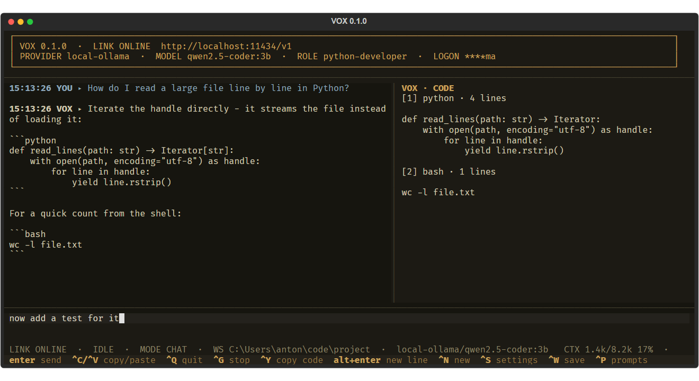

<p align="center">
  
</p>

# VOX

A terminal chat client for coding, for any OpenAI-compatible endpoint: Ollama,
llama.cpp server, vLLM, LM Studio, a remote gateway. Linux, macOS, Windows,
Termux.



## Requirements

- Python 3.12 or newer
- A running OpenAI-compatible server — for Ollama: `ollama serve`

## Quick start

**1. Install.** No administrator rights needed, safe to re-run.

```bash
git clone https://github.com/atagliente/vox && cd vox && sh install.sh
```

Windows, in PowerShell:

```bash
git clone https://github.com/atagliente/vox; cd vox; powershell -ExecutionPolicy Bypass -File .\install.ps1
```

It checks Python, installs through `pipx` (or a private virtual environment in
`~/.vox/venv`), puts a `vox` launcher on your user `PATH`, then runs the check
below.

**2. Check.**

```bash
vox doctor
```

```text
[ OK ] PYTHON   3.12.5
[ OK ] DEPS     openai 3.3.1 | textual 8.2.8 | rich 15.0.0
[ OK ] CONFIG   /home/you/.vox
[FAIL] LINK     cannot reach provider: http://localhost:11434/v1
```

Exit code `0` ready, `1` installed but the server is unreachable, `2` something
blocking. If `LINK` fails, fix the endpoint — see the next section.

**3. Run.**

```bash
vox
```

Type, press `Enter` to send. `/help` lists every command.

## Point it at your server

`~/.vox/config.json` is written on first run. The parts that matter:

```json
{
  "active_provider": "local-ollama",
  "active_model": "qwen2.5-coder:3b",
  "providers": {
    "local-ollama": {
      "base_url": "http://localhost:11434/v1",
      "api_key": "ollama",
      "extra_body": { "keep_alive": "30m" }
    }
  }
}
```

Edit it with `/settings` in the app, or `/config` to open it in `$EDITOR`; a
broken edit is rejected and the previous configuration kept.

For a server on another machine set `base_url` to `http://<address>:11434/v1`
and start Ollama there with `OLLAMA_HOST=0.0.0.0:11434 ollama serve`. That
server has **no authentication** — only do this on a network you trust.

## Keys

| Key | Action | Key | Action |
| --- | --- | --- | --- |
| `Enter` | send | `Ctrl+P` | prompts |
| `Alt+Enter` / `Ctrl+J` | new line | `Ctrl+R` | roles |
| `Ctrl+C` / `Ctrl+V` | copy / paste | `Ctrl+S` | settings |
| `Ctrl+Y` | copy last code block | `Ctrl+G` | stop generating |
| `↑` / `↓` | input history | `Ctrl+B` | side panel |
| `Ctrl+N` / `Ctrl+W` | new / save session | `Ctrl+Q` | quit |

The bottom row shows this legend at all times.

## Commands

| Command | Effect |
| --- | --- |
| `/model [name]`, `/provider [name]` | switch, without restarting |
| `/role [name]`, `/prompts`, `/sessions` | pick a persona, a saved prompt, a session |
| `/session-save [name]`, `/session-load <name>` | sessions live in `~/.vox/sessions/` |
| `/code [n]` | show the answer's code blocks, copy one by number |
| `/stats` | tokens, context fill, speed |
| `/warm` | preload the model on the server |
| `/agent on\|off`, `/workspace <path>` | coding-agent mode |
| `/config`, `/settings`, `/connect`, `/stop` | configuration and connection |

## Code on the right

When an answer contains fenced code, the right-hand panel opens with the blocks
laid out flush left, without the fences, updating as the answer streams — drag over them with `Shift` held and
your terminal copies exactly the code. `Ctrl+Y` copies the last block to the
system clipboard, `/code` lists them, `/code 2` copies the second, `/panel
index` switches the panel back to sessions, prompts and roles.

## Leaving

`Ctrl+Q` quits, asking first if the session has unsaved messages. If a request
to a slow provider is still in flight, VOX gives it a moment and then leaves
anyway rather than holding your shell hostage until the server answers.

## If the first token takes forever

A local model that is not in memory has to be loaded first, and on modest
hardware that can take minutes. VOX preloads it in the background right after
connecting — with a spinner naming the model and the endpoint, a time limit,
and `Ctrl+G` to stop waiting — so the wait happens while you type; `keep_alive` in `extra_body`
stops the server unloading it between messages; the spinner shows the elapsed
seconds, and `/stats` separates waiting from generating.

## Coding-agent mode

Off by default. `/agent on` lets the model list, read and search files and —
only after you approve each operation — write files, apply patches and run
commands. Before a write or a patch you see the unified diff of exactly what
would change.

Name the file and say it should be written — *"create hello.py with a main()
that prints hello, world; write it to disk"* — and pick a model that supports
tool calling; the smallest ones tend to answer with code instead of using the
tools. [More in the guide](docs/USAGE.md). Everything is confined to the workspace (`/workspace <path>`): `..`,
symlinks pointing outside and shell operators are refused, and commands run
under a timeout.

## Development

```bash
pip install -e ".[dev]"
pytest
```

No test needs a running inference server.

## More

- [docs/USAGE.md](docs/USAGE.md) — full guide: every option, roles and prompts,
  usage figures, themes, reasoning, agent details
- [spec.md](spec.md) — the specification the implementation follows

## License

PolyForm Noncommercial 1.0.0 — see [LICENSE](LICENSE). Non-commercial use only.
