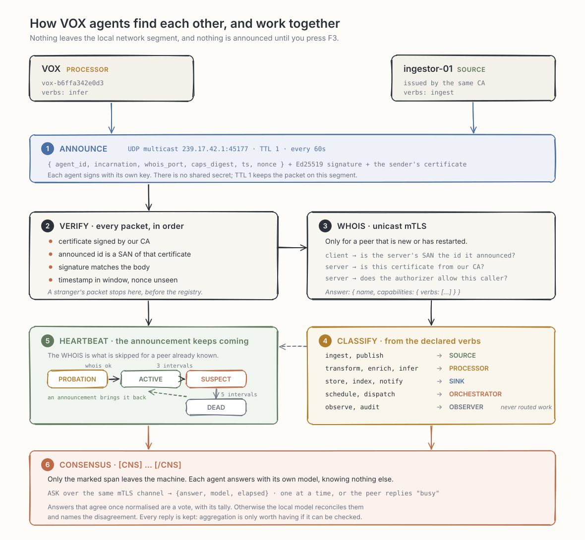

<p align="center">
  
</p>

# VOX

A terminal chat client for coding, for any OpenAI-compatible endpoint: Ollama,
llama.cpp server, vLLM, LM Studio, a remote gateway. Linux, macOS, Windows,
Termux.


## Requirements

- Python 3.11 or newer
- A running OpenAI-compatible server — for Ollama: `ollama serve`

## Install

```bash
git clone https://github.com/atagliente/vox && cd vox && sh install.sh
```

Windows, in PowerShell:

```bash
git clone https://github.com/atagliente/vox; cd vox; powershell -ExecutionPolicy Bypass -File .\install.ps1
```

No administrator rights needed, safe to re-run. The installer checks Python,
installs through `pipx` or a private virtual environment in `~/.vox/venv`, puts
a `vox` launcher on your user `PATH`, and offers to fetch missing system
packages.

## Check

```bash
vox doctor
```

```text
[ OK ] PYTHON   3.12.3
[ OK ] DEPS     openai 3.3.1 | textual 8.2.8 | rich 15.0.0
[ OK ] CONFIG   /home/you/.vox
[FAIL] LINK     cannot reach provider: http://localhost:11434/v1
```

Exit code `0` ready, `1` installed but the server is unreachable, `2` something
blocking.

## Run

```bash
vox
```

Type, press `Enter` to send. `/help` lists every command.

## Configuration

`~/.vox/config.json` is written on first run:

```json
{
  "active_provider": "local-ollama",
  "active_model": "qwen2.5-coder:3b",
  "providers": {
    "local-ollama": {
      "base_url": "http://localhost:11434/v1",
      "api_key": "ollama",
      "extra_body": { "keep_alive": "30m" }
    }
  }
}
```

Edit it with `/settings`, or `/config` to open it in `$EDITOR`. A broken edit is
rejected and the previous configuration kept. A project can override any setting
in its own `.vox/config.json`.

For a server on another machine, set `base_url` to `http://<address>:11434/v1`
and start Ollama there with `OLLAMA_HOST=0.0.0.0:11434 ollama serve`. That server
has no authentication — only on a network you trust.

## Keys

| Key | Action | Key | Action |
| --- | --- | --- | --- |
| `Enter` | send | `Ctrl+P` | prompts |
| `Alt+Enter` / `Ctrl+J` | new line | `Ctrl+R` | roles |
| `Ctrl+C` / `Ctrl+V` | copy / paste | `Ctrl+S` | settings |
| `Ctrl+Y` | copy last code block | `Ctrl+G` | stop generating |
| `↑` / `↓` | input history | `Ctrl+B` | side panel |
| `Ctrl+N` / `Ctrl+W` | new / save session | `Ctrl+T` / `Ctrl+E` | inspect / export |
| `F3` | join / leave the mesh | `F4` | the universe |
| | | `Ctrl+Q` | quit |

The bottom row shows this legend at all times.

## Commands

| Command | Effect |
| --- | --- |
| `/model [name]`, `/provider [name]` | switch, without restarting |
| `/role [name]`, `/prompts`, `/sessions` | pick a persona, a saved prompt, a session |
| `/session-save [name]`, `/session-load <name>` | sessions live next to your work |
| `/code [n]` | show the answer's code blocks, copy one by number |
| `/stats` | tokens, context fill, speed |
| `/inspect [on\|off]` | per-token measurements, live (`Ctrl+T` opens the view) |
| `/export [html\|json\|md\|toon]` | save the session and its figures (`Ctrl+E`) |
| `/warm` | preload the model on the server |
| `/mesh [on\|off\|new-ca\|sample-ca]`, `/universe` | the agent mesh |
| `/consensus [on\|off]` | ask the other agents, marked with `[CNS] … [/CNS]` |
| `/agent on\|off`, `/workspace <path>` | coding-agent mode |
| `/config`, `/settings`, `/connect`, `/stop` | configuration and connection |

## Code panel

Fenced code in an answer opens the right-hand panel, blocks laid out flush left
without the fences, updating as the answer streams. `Ctrl+Y` copies the last
block, `/code` lists them, `/code 2` copies the second, `/panel index` switches
the panel back to sessions, prompts and roles.

## Token inspection

`Ctrl+T` turns the measurement on and opens a table that fills while the answer
streams: the probability of each token, the entropy of the returned top-k, the
gap to the runner-up, and the alternatives passed over. Flat, close positions
are marked as decision points.

```text
INSPECT · qwen2.5:3b · top-k 5 · 40 tokens · 5 decision points
mean p 0.80   mean top-k entropy 0.72 bit

  28  ' a'            0.36   2.03    0.18   ' known' 0.18  ' based' 0.16
  29  ' simplified'   0.46   1.72    0.23   ' well' 0.22  ' fundamental' 0.12  ◄ DECISION
```

Entropy is computed over the returned top-k, not the full vocabulary, because
the API does not return the tail.

Off until asked for: logprobs make each response several times heavier and not
every provider supports them. A provider that refuses is retried without them.

`/export` writes the session as `vox-<timestamp>.html`, `.json`, `.md` and
`.toon`: parameters at the top, the exchange, then the statistics and decision
points. The HTML is one self-contained file with no JavaScript.

## Where your files go

Everything a conversation produces lands in the directory you launched from:

```text
~/code/project/
├── vox-20260825-143205.html      an export
├── vox-20260825-143205.json
├── vox-20260825-143205.md
├── vox-20260825-143205.toon
├── vox-session-refactor.json     a saved session
└── src/
```

One line ignores the lot:

```bash
echo 'vox-*' >> .gitignore
```

`~/.vox` keeps what belongs to you rather than to a project: configuration,
roles, saved prompts, input history, logs.

## Coding-agent mode

Off by default. `/agent on` lets the model list, read and search files and —
after you approve each operation — write files, apply patches and run commands.
A write or a patch shows the unified diff first.

Name the file and say it should be written — *"create hello.py with a main()
that prints hello, world; write it to disk"* — and pick a model that supports
tool calling. Everything is confined to the workspace (`/workspace <path>`):
`..`, symlinks pointing outside and shell operators are refused, and commands
run under a timeout.

## The mesh

`F3` puts VOX on the local agent mesh: the border turns red, the header reads
`Universe: ON-LINE`, the status bar counts the agents it can see. `F4` opens the
universe. `F3` again goes offline. `/mesh on|off` and `/universe` do the same.




`caps_digest` is how a peer says its capabilities changed: a different digest
sends it back to PROBATION and a fresh WHOIS follows. `incarnation` is the
process's life, so a restart discards everything cached about that peer.

Discovery answers who is out there and what they can do. The WHOIS channel
carries descriptors, not work: `agent.peers_for("transform")` gives the active,
non-passive agents that declared that verb, and the endpoint for each. The work
protocol on top is yours to choose.

### Names

An agent's name ends in a fingerprint of the machine: the first 12 hex
characters of the SHA-256 of its MAC address — `vox-b6ffa342e0d3`, or
`workstation-b6ffa342e0d3` when `mesh.agent_id` names a label. The address is
hashed, never announced.

The fingerprint is appended even when `agent_id` is set, so one `config.json`
copied across a fleet still gives every machine its own name, certificate and
SAN.

### Certificates

VOX ships a sample certificate authority, so two fresh installations on the same
segment already trust each other: install, press `F3` on both, and they appear
in each other's universe.

Its private key is in this repository, so anyone holding VOX can mint an
identity for it. While it is in use the header reads `Universe: ON-LINE (SAMPLE
CERT)`, the status bar appends `DEMO CERT`, and `vox doctor` reports a warning.

```text
/mesh new-ca
```

generates an authority that exists only on your machine, moves the sample files
aside and reissues this agent. `/mesh sample-ca` returns to the shipped one.
Every other machine then needs a certificate from your authority: copy the whole
`~/.vox/pki` directory to machines you trust, or keep `ca.key` on one machine and
hand out only a leaf certificate plus `ca.crt`.

There is no shared secret either way. Every agent signs with its own private key,
which never leaves its machine.

## CONSENSUS

Mark part of a message and it goes to the other agents on the mesh:

```text
Here is the stack trace from our staging box, with customer ids in it.
[CNS]Is a lock-free ring buffer safe when a reader can stall indefinitely?[/CNS]
```

Only the marked span leaves the machine. Everything around it stays local, and
that boundary is held by a test, not by good intentions.

Each agent answers with its own model, knowing nothing but the question. What
comes back is reconciled: if the answers agree once normalised, that is the
result and the tally is reported; otherwise your local model writes the final
answer and names where the agents differed. Either way every reply stays on
screen, in the transcript and in the side panel (`/panel consensus`), and in
the exported report.

`/consensus` shows who would be asked. `/consensus off` stops both asking and
answering.

Measured on one machine, two nodes, `qwen2.5-coder:3b` answering: discovery to
first answer in 14.0s, of which 14.0s was the model.

**It is aggregation, not agreement.** mTLS proves who a peer is, not that it is
truthful; there is no Byzantine tolerance, and a member that lies is believed.
A round is as slow as its slowest peer. Every agent asked sees the marked text
in full — which is why VOX refuses to distribute at all while on the sample
certificate, where anyone on the segment could be listening.

## Development

```bash
pip install -e ".[dev]"
pytest
```

No test needs a running inference server. `docs/make_mesh_diagram.py` regenerates
the diagram above.

## More

- [docs/USAGE.md](docs/USAGE.md) — full guide: every option, roles and prompts,
  usage figures, themes, reasoning, agent details
- [vox_chat/discovery/README.md](vox_chat/discovery/README.md) — the mesh
  protocol and its security model
- [spec.md](spec.md) — the specification the implementation follows
- [CHANGELOG.md](CHANGELOG.md) — what changed and when

## License

PolyForm Noncommercial 1.0.0 — see [LICENSE](LICENSE). Non-commercial use only.
